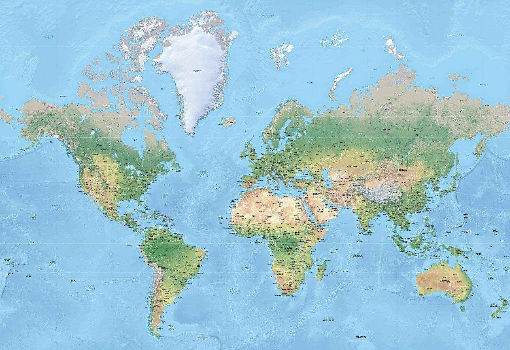
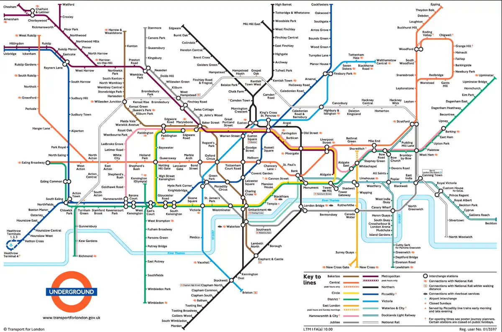

# La notion d'échelle

L'**échelle cartographique** indique le **rapport d'une distance mesurée sur la carte à la distance réelle sur le terrain**.

Une échelle de 1:100'000 signifie que 1 cm sur la carte correspond à 100'000 cm sur le terrain. 100'000 cm correspondent à 1000 mètres, donc 1 km.

Une échelle 1:100'000 est une échelle dite de «1 à 100'000». Dans le langage courant, on a parfois tendance de parler p.ex. d'une «carte au 100'000». Techniquement, cette indication est fausse, car il s'agit dans cet exemple d'une carte au 1:100'000.

## Petite échelle versus grande échelle

Il est important d'utiliser correctement les termes de «petite échelle» et «grande échelle». En effet, souvent, ces termes sont utilisés à l'envers.

Une carte au 1:100'000 sera ainsi une **carte à petite échelle**, tandis qu'une carte au 1:1'000 sera une **carte à grande échelle**. C'est logique dans le sens où 1:100'000 = 0.000001 < 1:1'000 = 0.001, mais c'est contre-intuitif car la région représentée sur une carte à grande échelle est plus petite en taille que la région sur une carte à petite échelle (au moins si les dimensions physiques de la carte ne change pas).

## Échelle numérique versus échelle graphique

L'échelle est une propriété importante de chaque carte, et en conséquence, elle doit généralement être indiquée sur la carte. On peut faire ceci à l'aide d'une échelle numérique (ci-dessous à gauche) ou une échelle graphique (à droite):

Une échelle numérique indique le rapport «1:25'000». Les cartes topographiques imprimées possèdent en principe toujours une échelle numérique précise, car elle est très importante pour évaluer les distances sur le terrain.

L'avantage de l'échelle numérique est qu'elle est très précise et qu'elle facilite la détermination des distances sur la carte. En effet, il suffit de mesurer la distance avec une règle et ensuite appliquer le facteur de multiplication de l'échelle.

Le désavantage de l'échelle numérique est qu'elle nécessite une grande précision au moment de l'impression. En effet, même si on imprime un fichier PDF en format A4, le logiciel appliquera souvent une mise à l'échelle de 95% ou similaire. Du coup, l'échelle n'est pas correcte et il y a le risque que les distances sont évaluées de manière incorrecte. Pour une carte digitale, une échelle numérique ne fait pas de sens du tout, car elle sera affichée sur différents écrans avec des tailles totalement différentes.

Une échelle graphique a l'énorme avantage qu'elle est toujours juste tant qu'elle était correcte au moment de créer la carte, même si elle subit un agrandissement ou une réduction.

Le désavantage de l'échelle graphique est que pour mesurer une distance sur la carte, il faut procéder à une règle de 3.

De manière générale, les échelles numériques sont utilisées uniquement pour les cartes topographiques ou autres cartes nécessitant une grande précision au niveau de l'échelle, et ceci seulement pour les cartes papier imprimées par des professionnels (p.ex. une imprimerie qui garantit la taille de reproduction).

Pour toutes les cartes thématiques, toutes les cartes digitales et toutes les cartes qui subissent potentiellement un agrandissement ou une réduction (même minime), nous utiliserons toujours une échelle graphique. Ceci s'applique probablement à toutes ou presques toutes les cartes que nous allons créer dans notre carrière professionnelle. L'échelle graphique peut être très simple, comme dans l'exemple ci-dessus.

## Quand omettre l'échelle?

En principe, chaque carte doit avoir une échelle claire. Cependant, il y a quelques cas spéciaux:

Parfois, sur une carte à très petite échelle, il se peut que l'échelle n'est pas la même à chaque endroit sur la carte. Un exemple d'un tel cas est la carte suivante, qui est une carte du monde avec une projection de Mercator:

  
<small>Source: [www.onestopmap.com](https://www.onestopmap.com/world-maps/world-mercator-europe-africa-centered-635/)</small>

En termes cartographiques, le choix de la projection de Mercator pour une carte du monde est un choix terrible. Quant à l'échelle cartographique, en raison de la déformation énorme à proximité des pôles, il n'est pas possible d'indiquer une échelle correcte pour la totalité de la carte. Il faudrait utiliser une double stratégie pour palier à ce problème:

1. Ne pas utiliser une projection qui déforme autant certaines parties du globe
2. On peut ajouter une échelle qui est valable à l'équateur et ajouter une notice en ce sens. Éventuellement, on peut compléter avec une deuxième échelle qui est valable p.ex. pour les latitude 45° N et S.

Donc même dans ce cas, on ajoutera une échelle, mais complété d'un commentaire.

Il y a cependant certaines cartes où on ne peut pas ajouter d'échelle. Un exemple d'un tel cas est un plan schématique d'un réseau de transport, comme p.ex. la carte du métro de Londres:

  
<small>Source: [printable-maps.blogspot.com](https://printable-maps.blogspot.com/2015/04/map-of-london-tube.html)</small>

Ce genre de carte est construite de sorte à complètement exagérer les régions denses (le centre de Londres) et de condenser les régions périphériques. Une échelle ne fait donc absolument pas de sens sur une telle carte.

## Attention au relief

Pour connaître la distance à vol d'oiseau entre deux endroits, il ne suffit pas de considérer uniquement l'échelle, au moins en régions de montagne. Sur la carte, on pourra trouver la distance entre deux lieux *au plat*. Par contre, avec une différence d'altitude entre les deux lieux, la distance à vol d'oiseau sera un peu plus longue que la distance mesurée sur la carte. Généralement, cette différence est minime, mais elle peut être calculée facilement à l'aide du théorème de Pythagore.

La figure ci-dessus montre un exemple où la distance mesurée sur la carte correspond à 12 km. Cette distance correspond à la droite AC. La distance à vol d'oiseau correspond à la droite AB. La droite BC est dans l'exemple 2400 m - 450 m = 1950 m, donc 1.95 km. Par la suite, une application simple du théorème de Pythagore donne le résultat (environ 12.157 km).
