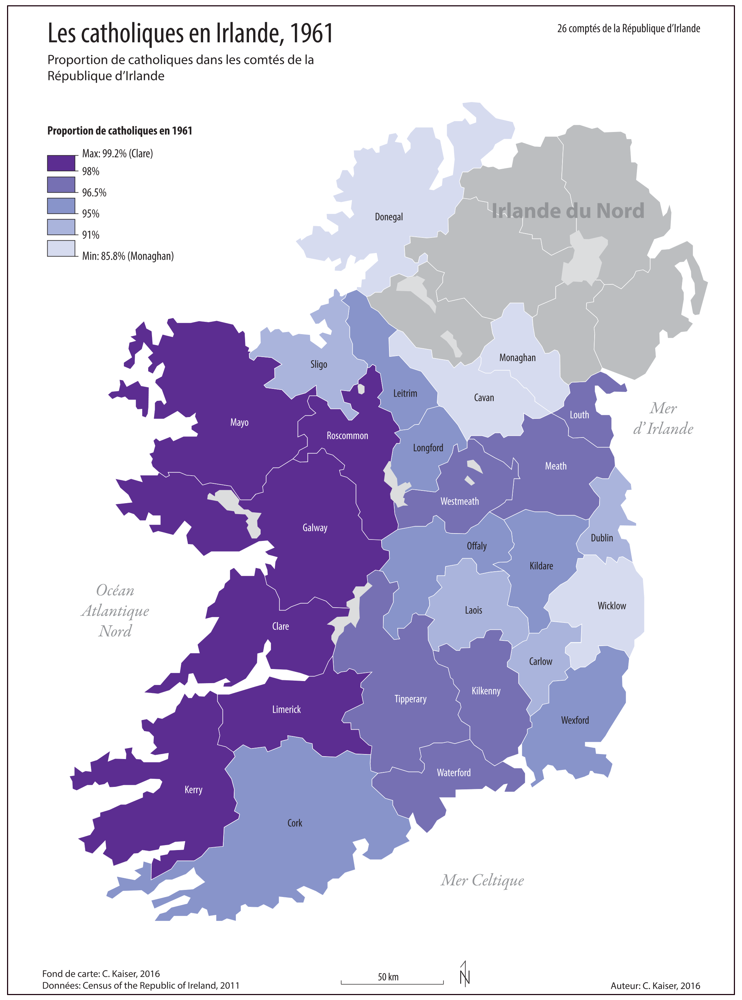
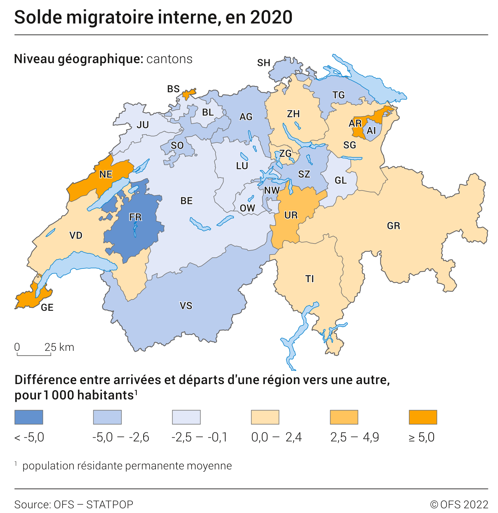
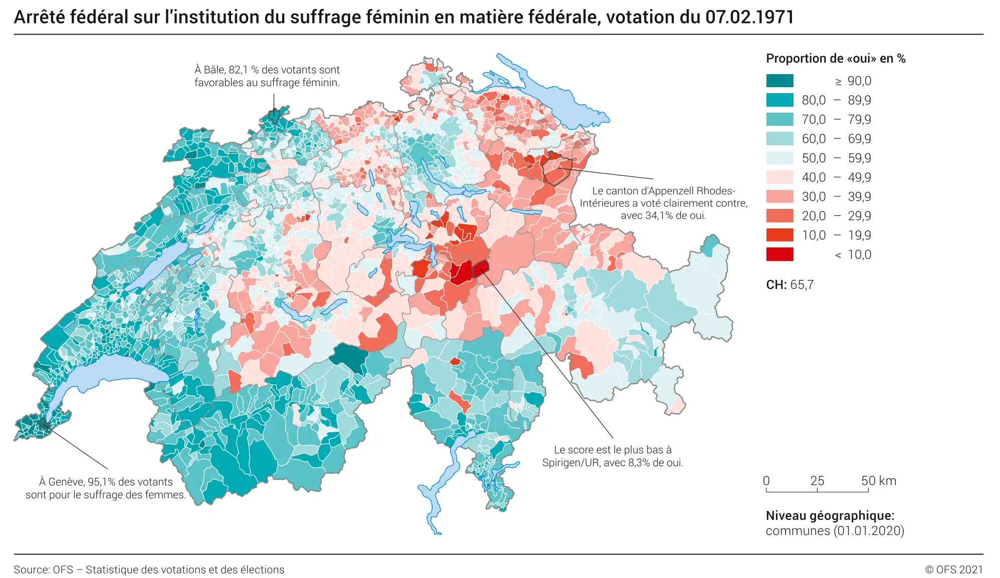
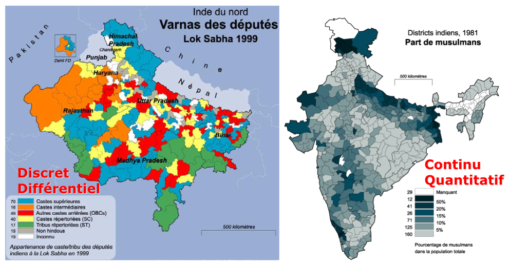

# Carte choroplèthe

La carte choroplèthe est une carte thématique très répandue. Voici un exemple:

Sur une carte choroplèthe, les surfaces discrètes (des polygones) sont représentées en **différents tons d'une même couleur**, donc par exemple du vert clair au vert foncé, du rouge clair au rouge foncé, ou aussi du gris clair au gris foncé.

Il s'agit d'une **carte univariée** qui permet de **représenter la structure d'un phénomène**, et non pas son ampleur. Ou plus concrètement, les types de données suivants peuvent être représentés sur une carte choroplèthe:

- une proportion de quelque chose
- un taux
- une densité d'un phénomène

Une carte choroplèthe ne permet par contre pas de représenter des phénomènes de taille, comme des nombres absolus.

## Carte choroplèthe bicolore

En haut, nous avions mentionné que sur les cartes choroplèthes le remplissage des polygones se fait par une seule couleur dont le ton varie du clair au foncé.

Toutefois, il arrive qu'on voit des cartes choroplèthes qui présentent deux couleurs, comme l'exemple suivant:

  
<small>Source: [Office fédéral de la statistique](https://www.bfs.admin.ch/asset/fr/21524598)</small>

Sur cette carte, les polygones sont remplis soit par un ton de bleu, soit par un ton de jaune. Techniquement, il s'agit ici d'une **carte bivariée**. Dans l'exemple ci-dessus, la variable cartographiée est la différences entre le nombre de résidants arrivants d'un autre canton moins le nombre de résidants partants vers un autre canton. La couleur jaune représente dans ce cas la variable *"surplus d'arrivées"*, tandis que le bleu représente un *"surplus de départs"*.

Nous trouvons ce genre de cartes aussi typiquement après des votations. Voici un exemple:

  
<small>Source: [Office fédéral de la statistique](https://www.bfs.admin.ch/asset/fr/15464770)</small>

Dans ce cas, les communes ayant accepté le sujet de vote sont représentés en ton de vert-bleu, et celles ayant refusé en ton de rouge. Le taux d'acceptation respectivement de refus détermine le ton de la couleur, du clair au foncé.

## Carte choroplèthes avec données catégorielles

Une carte choroplèthe permet de représenter des données continues comme des données catégorielles. Voici deux cartes pour voir la différence:

La carte de droite est une carte choroplèthe classique où la variable représentée est une proportion (pourcentage de musumlmans par district); il s'agit donc d'une **valeur relative** traduite avec un **dégradé du clair au foncé**.

La carte de gauche est un cas où la variable représentée est de **nature catégorielle**. Il s'agit d'une autre forme possible de la carte choroplèthe. La différence est dans la façon de représenter les données:

- Pour des **données quantitatives continues**, et plus précisément des valeurs relatives (proportions, taux, densités), on utilisera un **dégradé du clair au foncé** (p.ex. bleu clair au bleu foncé, rouge clair au rouge foncé, etc.).

- Pour des **données catégorielles discrètes** à caractère différentiel, on utilisera des **couleurs différentes**.

Le cas de la carte choroplèthe bicolore est en fait une combinaison d'un dégradé du clair au foncé, mais pour deux couleurs différentes (deux catégories).
