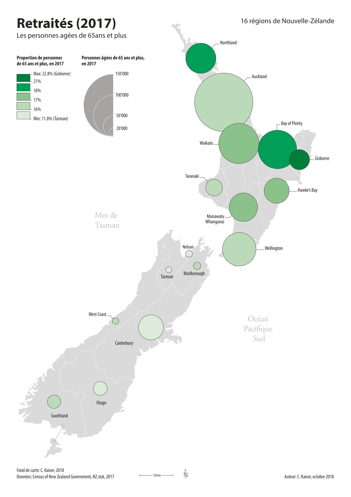
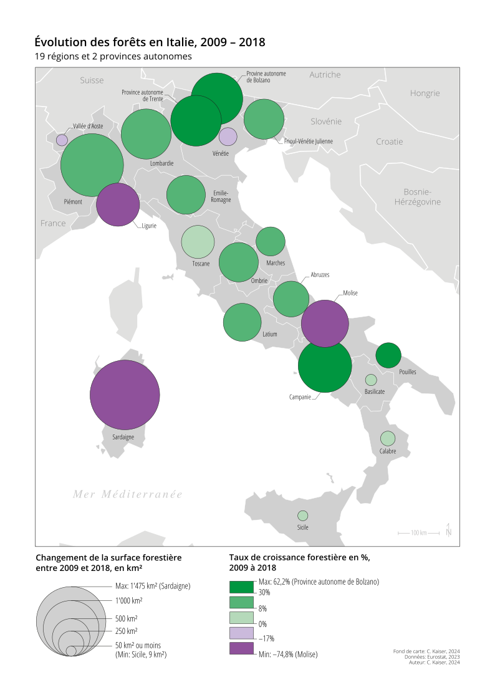

# Carte en symboles proportionnels colorés

Une carte en symboles proportionnels colorés est une carte en symboles proportionnels dont les symboles sont colorés de la même manière que les polygones le sont pour une carte choroplèthe.

En terme de visualisation, nous pouvons donc considérer qu'une carte en symboles proportionnels colorés est une combinaison entre les symboles proportionnels et la carte choroplèthes.

Voici un exemple d'une telle carte:

L'avantage de ce type de carte est qu'il permet de représenter à la fois une variable absolue (pour représenter **l'ampleur d'un phénomène**) et une variable relative (pour représenter **la structure d'un phénomène**).

Si on se rappelle de la carte choroplèthe, elle peut représenter uniquement des valeurs relatives, donc des pourcentages, taux ou densités. Ce principe est valable pour le remplissage des symboles.

La carte en symboles proportionnels simple ne peut représenter que des valeurs absolues, donc des nombres etc.

Une carte en symboles proportionnels colorés permet donc de combiner les deux représentations. Par contre, il est important de **représenter qu'un seul phénomène** sur la carte. Dans l'exemple de la carte ci-dessus, il s'agit du nombre de retraités pour la taille des symboles, et la proportion de retraitées pour le remplissage. Il s'agit d'un exemple typique où le phénomène représenté est la retraite, avec **l'aspect taille** (le nombre) et **l'aspect structurel** (la proportion).

## Carte en symboles proportionnels colorés avec légende bicolore

Comme pour la carte choroplèthe, il est dans certains cas nécessaire d'utiliser une légende bicolore pour le remplissage des symboles proportionnels.

Ceci est le cas par exemple si on veut cartographie une évolution. Une évolution peut être décomposée en une évolution absolue (la différence d'un effectif), et une évolution relative (la différence en pourcentages, c'est-à-dire un taux de croissance). Ainsi, une augmentation de population peut être décrite de deux manière, p.ex. pour deux villages A et B:

<table>
<thead>
<tr>
  <th>Village</th>
  <th>Population en 2020</th>
  <th>Population en 2021</th>
  <th>Évolution absolue</th>
  <th>Évolution relative</th>
</tr>
</thead>
<tbody>
<tr>
  <td>A</td>
  <td>100</td>
  <td>110</td>
  <td>+10 personnes</td>
  <td>+10%</td>
</tr>
<tr>
  <td>B</td>
  <td>10'000</td>
  <td>9'500</td>
  <td>−500 personnes</td>
  <td>−5%</td>
</tr>
</table>

Dans cet exemple on voit facilement qu'une évolution absolue relativement importante (−500 personnes) peut constituer une évolution relative médiocre pour le village B (−5%), et une évolution absolue relativement faible (+10 personnes) peut représenter une évolution relative assez élevée pour le village A (+10%).

Les deux aspects d'une évolution, l'évolution absolue et realtive, sont donc complémentaires, ce qui justifie une cartographie des deux composantes à la fois.

Une évolution doit en même temps être differenciée en augmentation ou diminution. Ceci car les symboles peuvent représenter uniquement des valeurs positives. Pour distinguer entre évolution positive et négative, nous allons donc utiliser une couleur séparée (d'où la légende bicolore).

La figure ci-dessous donne un exemple d'une carte d'une évolution:

Par ailleurs, le résultat d'une votation peut également être cartographiée avec une carte en symboles proportionnels colorés avec une légende bicolore. Dans ce cas, le nombre de votes est représenté par la taille des symboles et le taux d'acceptation par le remplissage des symboles. Un taux d'acceptation de 50% ou plus (= acceptation du vote) est alors montré dans une couleur différente d'un taux d'acceptation de moins de 50% (= refus du vote).

La valeur où la couleur change (p.ex. 0% pour une évolution, 50% pour le taux d'acceptation d'un vote) est appelée ***«seuil externe»***. Cette valeur doit figurer dans tous les cas dans la légende.
