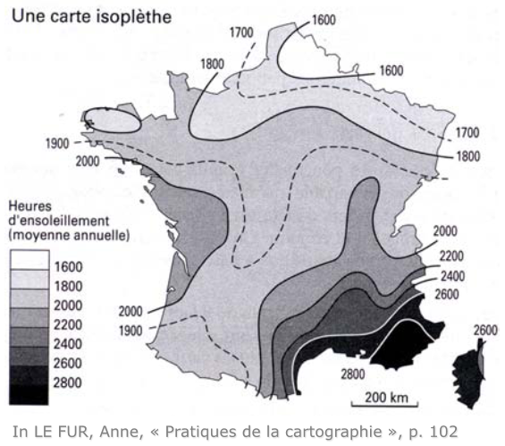
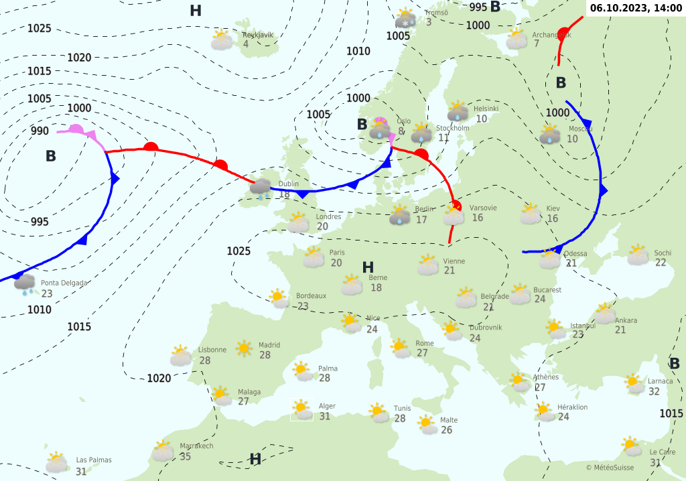

# Carte en courbes

Les cartes en courbes contient des **isolignes** (aussi appelées *isoplèthes*) qui est **une ligne** (respectivement une courbe) le long de laquelle **les valeurs sont contantes**. Voici un exemple d'une telle carte:

Dans ce cas, les **surfaces** entre les isolignes sont également remplies de la même manière que pour une carte choroplèthe. Ceci permet d'augmenter l'effet visuel et la lisibilité de la carte.

La carte en courbe est facile à combiner avec d'autres éléments sur la carte. Ainsi, les courbes de niveau sur une carte topographique représentent aussi une carte en courbes. Par contre, pour qu'on parle de carte en courbes, le phénomène représenté par les isolignes doit être le sujet principal. Dans le cas d'une carte topographique, les courbes de niveau ne sont qu'un élément parmi beaucoup d'autres, et on ne parlera donc pas de carte en courbe.

Le principe des isolignes est aussi appliqué pour certaines cartes météorologiques où la pression athmosphérique est dessinée comme isolignes:

  
<small>Source: [MétéoSuisse](https://www.meteosuisse.admin.ch/#tab=forecast-map)</small>

Cette carte figure également d'autres éléments, dont les fronts, température et météo à certains endroits.

Une carte en courbes permet de **représenter un phénomène continu** dans l'espace, donc un phénomène qui est présent à chaque endroit du territoire.

En raison de la nature de la carte en courbes de représenter des phénomènes continus seulement, les applications principales de ce type de carte est par rapport aux données environnementales. Mais en prinicipe, on peut aussi l'utiliser dans d'autres cas pour représenter une densité.