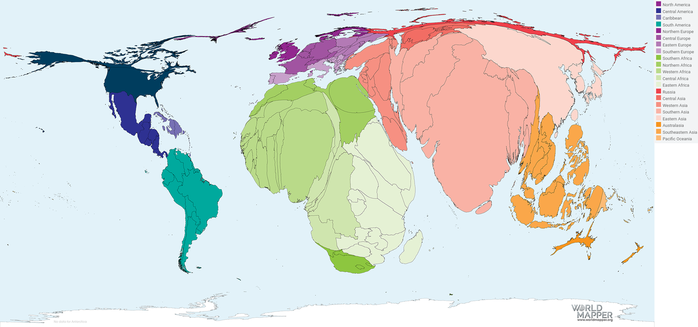

# Anamorphose

Une anamorphose, parfois aussi appelée **cartogramme** du terme anglais "*cartogram*", est une carte où les entités géographiques sont représentée en sorte à ce que la surface est proportionnelle à la valeur de la variable cartographiée. En d'autres termes, les géométries de base sont remplacées par une version déformée de la géométrie, ou par un symbole tel qu'un rectangle ou un cercle.

Voici l'exemple d'une carte en anamorphose montrant le nombre de naissances en 2022 par pays:

  
<small>Source: [WorldMapper](https://worldmapper.org/maps/total-births-2022/)

Les couleurs dans cet exemple représentent une variable catégorielle avec les régions du monde. Elles ont été ajoutées uniquement pour faciliter l'orientation. En effet, suivant le degré de déformation d'une anamorphose, il n'est pas évident de s'y retrouver.

L'anamorphose ci-dessus a un défaut important qui est l'absence de légende pour la taille. En effet, il faudrait y ajouter une légende similaire à celle des symboles proportionnels.

Ce type d'anamorphose est appelée **anamorphose continguë**, car les géométries sont toujours connectées aux voisins comme dans la carte initiale.

Dans une **anamorphose non-contiguë**, les relations de voisinage ne sont pas forcément maintenues. Voici un exemple d'une telle anamorphose (sans titre ni légende, mais ça montre le principe):

  
<small>Source: [https://observablehq.com/@d3/non-contiguous-cartogram](https://observablehq.com/@d3/non-contiguous-cartogram)

Ce type d'anamorphose a été inventé par Judy M. Olson en 1976 (publication originale: [DOI:10.1111/j.0033-0124.1976.00371.x](https://doi.org/10.1111/j.0033-0124.1976.00371.x))

Un autre type d'anamorphose est le **cartogramme de Dorling**, d'arpès Danny Dorling, professeur à l'Université d'Oxford:

Dans ce cas, les géométries des régions ont été remplacés par des symboles proportionnels.

## Types de données

Tous les types d'anamorphose permettent de visualiser des **données absolues**, c'est-à-dire des effectifs et nombres. En terme de représentation, une anamorphose peut être un remplacement pour une carte en symboles proportionnels.

## Anamorphose bivariée

Le caractère de l'anamorphose permet de facilement remplir les géométries ou symboles avec des couleurs ou un dégradé du clair au foncé. Le remplissage se fait de manière analogue à une carte choroplèthe, on pourra donc parler d'une "*anamorphose choroplèthe*".
