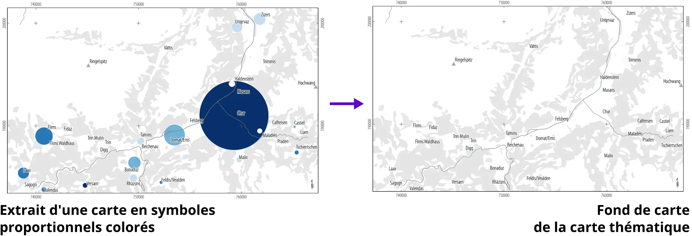
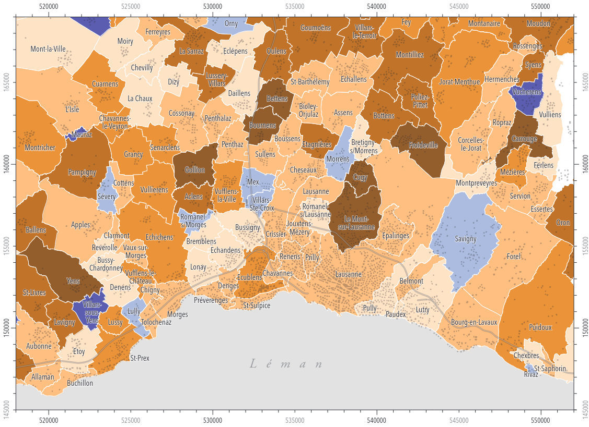
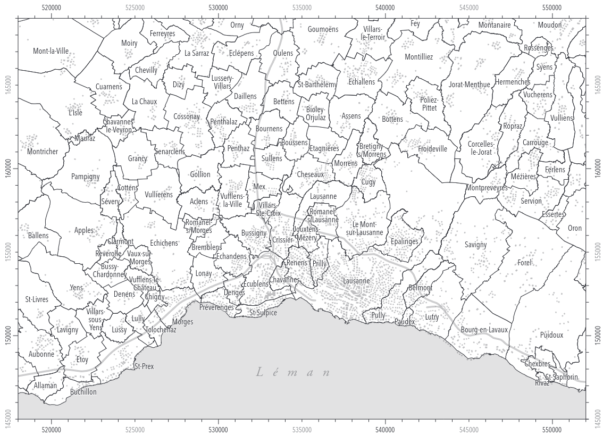

# Le fond de carte

Le fond de carte représente la base géographique d'une carte thématique.
Il sert de support pour l'ajout des informations thématiques qui y sont superposées.

Généralement, il s'agit d'une représentation simplifiée du territoire qui a comme but de situer les éléments de la carte, donc de permettre l'orientation sur la carte.
En même temps, le fond de carte ne doit pas surcharger la carte avec des détails inutiles pour la thématique représentée.
Il doit rester en arrière-plan et aussi discret que possible.

La figure ci-dessous montre le fond de carte (à droite) pour une carte thématique:

## Éléments du fond de carte

De manière générale, **uniquement les éléments qui sont nécessaires pour situer les éléments** de la carte doivent figurer sur le fond de carte. On peut aussi y ajouter des **éléments qui aident à l'interprétation** de la carte, donc des éléments qui sont en lien avec la thématique de la carte. Cependant, il est important de garder en tête que le **fond de carte doit être aussi discret que possible**. La façon la plus simple pour y arriver est de **représenter tous les éléments du fond de carte en gris**, généralement en gris clair, et de représenter uniquement les **éléments thématiques en couleurs**. Donc les lacs par exemples pourraient être en gris clair, voire blanc, au lieu de bleu. Ceci permet **d'augmenter le contraste entre fond de carte et thématique** et ainsi augmenter la lisibilité de la carte.

Mais quels éléments figurent concrètement dans un fond de carte? Ceci dépend essentiellement du but de la carte thématique, mais voici une liste de quelques éléments qu'on trouve typiquement dans le fond de carte:

- Les **limites administratives** les plus importantes. Sur une carte choroplèthe, on est évidemment obligé de les mettre pour pouvoir remplir les polygones. Pour une carte en symboles proportionnelles, on va souvent mettre les limites administratives correspondant aux symboles, mais ce n'est pas nécessaire dans tous les cas. Parfois, les limites administrative d'un niveau supérieur peuvent suffire (p.ex. les limites cantonales pour des symboles par commune).

- Les **lacs principaux** s'ils sont importants au niveau de l'orientation. Ainsi, le Léman va certainement figurer dans une carte thématique à l'échelle de la Suisse. Par contre, le lac de Bret est certainement trop petit.

- Les **noms des éléments importants** (les étiquettes, toponymes, ...). Un grand lac p.ex. devra avoir un nom. Souvent, on va aussi devoir ajouter le nom des régions de référence de la thématique, donc pour une carte thématique à l'échelle des communes, on va en principe ajouter les noms des communes. Ceci dépend aussi du nombre de régions, du public cible (si le lecteur de la carte connaît de toute manière les noms des régions sans qu'il figure sur la carte on n'a pas besoin de l'ajouter).

Ce sont déjà les éléments les plus importants. D'autres éléments peuvent être rajoutés au cas par cas, dont p.ex.

- Les **routes principales**, p.ex. les autoroutes, si cela ajoute une information intéressante pour le lecteur de la carte (donc si la présence des routes sur la carte aide dans la compréhension du phénomène représenté).

- Les **bâtiments**, de manière discrète, si cela apporte une plus-value et ne dérange pas la lisibilité de la carte.

- Les **cours d'eau** principaux, surtout en région de montagne où les cours d'eau sont un facteur important au niveau de la structure du paysage (ils permettent de reconnnaître les vallées).

- En région de montagne, il est parfois utile d'avoir les **sommets principaux** (ensemble avec le nom et l'altitude).

- Toujours en région de montagne, l'orientation peut parfois être facilitée en ajoutant un **relief ombré**. Il doit être très léger pour ne pas déranger la lecture de la carte (en gris très clair). Voici un exemple d'un relief ombré:  
  
   
  <small>Source: <a href="https://eduard.earth/">https://eduard.earth</a></small>

- Suivant comment, à la place du relief ombré, on peut parfois ajouter la **surface forestière**. En région de montagne, elle suit aussi grossièrement les vallées. Par ailleurs, la surface forestière peut aussi montrer les régions qui ne sont pas peuplées.

- Si l'orientation est importante, il est possible d'ajouter les **graticules** (les lignes de coordonnées)

Voici encore un exemple d'une carte thématique, une carte choroplèthe cette fois:

Et voici le fond de carte correspondant:

Sur ce fond de carte, on trouve un nombre relativement important d'éléments:

- Les limites des communes, ce qui est logique vu qu'il s'agit d'une carte choroplèthe au niveau communale

- Le Léman, en gris clair et avec toponyme.

- Les noms de chaque commune, pour que le lecteur puisse s'y retrouver. La carte avait été faite pour les décideurs politiques de l'agglomération de Lausanne. Il est du coup important de connaître les noms de toutes les communes.

- La carte possède également des amorces des graticules en marge de la carte, ceci à la place d'une échelle qui serait autrement obligatoire.

- La carte contient également les bâtiments en tout léger ainsi que l'autoroute. Ces éléments sont importants pour l'interprétation de la carte (notamment pour expliquer des valeurs de certaines communes le long de l'autoroute).

Par ailleurs, il est encore intéressant à noter que le contour des communes sur la carte est un trait fin d'environ 0.3 pt en blanc. Ceci permet de réduire le contraste et ainsi mieux faire ressortir les couleurs de la thématique. Ceci dans un but d'augmenter la lisibilité de la carte.

Pour résumer, ce qui est très important à retenir:

<ul>
    <li>le fond de carte doit faciliter l'orientation</li>
    <li>il doit être discret, et en principe en tons de gris légers</li>
    <li>il ne faut pas surcharger le fond de carte</li>
    <li>généralement, on ne peut pas juste prendre la carte topographique (même en noir et blanc) comme fond de carte, car il y a trop d'éléments sur une carte topographique</li>
</ul>

Ensuite, deux autres éléments qui sont importants pour le fond de carte:

- La **topologie** doit être respectée
- Le **niveau de généralisation** doit être adapté

Ces éléments sont traités par la suite.
