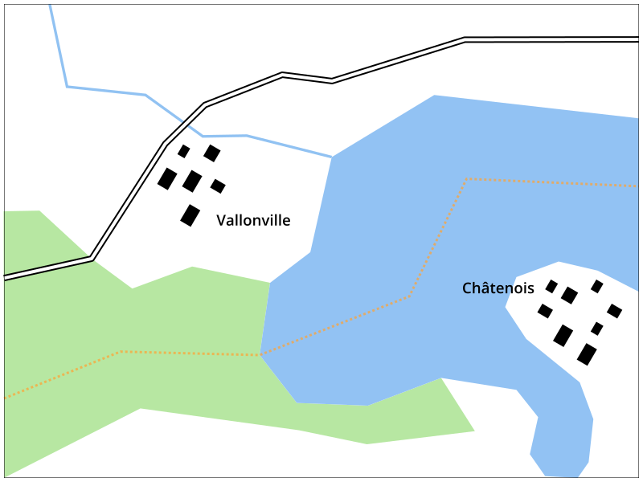
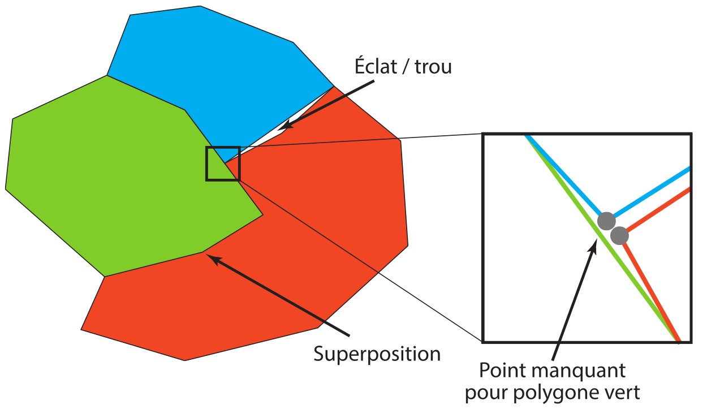
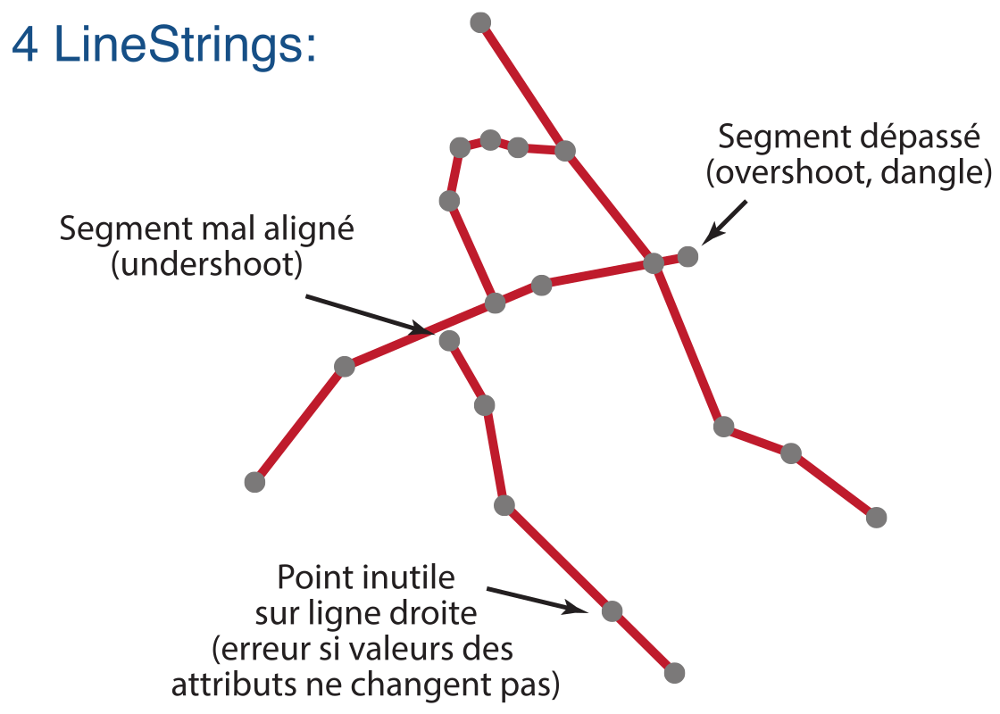

# Topologie

La topologie est un concept qui s'applique au modèle vecteur en cartographie et dans les Systèmes d'Information Géographique (SIG). Pour comprendre le problème que la topologie essaie de résoudre, considérons l'illustration suivante:

Cet extrait de carte consiste de plusieurs couches thématiques différentes:

- lac
- cours d'eau
- forêt
- bâtiments
- route
- communes

Comme discuté plus tôt dans la section sur les modèles du territoire et la notion de couche, cette répartition en plusieurs couches vient des caractéristiques du modèle vectoriel et du fait qu'une couche vectoriel possède une table d'attributs commune à toutes les entités de la couche.

Toutefois, pour obtenir une carte cohérente, **les différentes couches doivent correspondre entre elles**. Ainsi, il faut faire en sorte qu'aucun bâtiment n'est traversé d'une route, que le cours d'eau se termine dans le lac et non pas 50 mètres avant, que la route ne passe pas dans le lac, etc. Pour cela, il faut se rendre compte que chaque géométrie dans les différentes couches peut être éditée séparément.

Si on considère en même la généralisation cartographique qui modifie certaines géométries pour les adapter à l'échelle, on constate que chaque ensemble de couche doit être adapté à une échelle précise. Si on simplifie une route mais non pas les bâtiments, il peut vite arriver qu'une route, après élargissement, passe par dessus un bâtiment.

Un problème similaire peut arriver avec des polygones qui doivent se juxtaposer. On peut par exemple modéliser chaque commune avec un polygone car il s'agit d'un phénomène zonal. Cependant, il faut être certain que la frontière partagée entre deux communes voisine soit identique entre les deux polygones (où chaque polygone est défini séparément).

C'est à ce niveau qu'intervient la topologie. **La topologie assure que les informations dans une couche vectorielle, et entre différentes couches thématiques, sont encodées correctement.** Concrètement, elle assure que les géométries qui doivent se superposer se superposent, et celles qui sont distincts sont effectivement distincts dans la carte. Quelques exemples:

- les limites de communes voisines doivent se superposer
- la limite communale peut par endroit suivre la rivière, la ligne de la rivière doit donc correspondre au polyogne de la commune
- la limite communale ne doit pas dépasser du polygone du district dans lequel la commune se localise
- la route doit passer par dessus la rivière s'il y a un pont, mais dessous s'il y a un tunnel

On peut donc dire que **la topologie assure la cohérence géométrique des entités** sur la carte.

La topologie s'assure également qu'il n'y a **pas de géométries invalides**. On se rappelle: la validité des géométries vectorielles est définie dans la Simple Feature Specification (SFS).

## Erreurs de topologie

Si la topologie n'est pas respectée, on parle d'une *erreur de topologie*. On peut distinguer plusieurs types d'erreurs.

Pour une couche de polygones où les limites doivent se superposer (p.ex. pour des polygones de pays, de cantons ou d'autres entités administratives), certaines erreurs sont illustrées dans la figure suivante:

On parle d'un **éclat** ou **trou** lorsqu'il y a un écart entre deux polygones où il ne devrait pas en avoir. On anglais, on parle de *«sliver»*.

On peut aussi avoir une **superposition** entre deux polygones qui devraient être adjacents.

Si plusieurs polygones se rencontrent, chaque polygone doit avoir un noeud à l'intersection.

Pour des couches de lignes, p.ex. des réseaux routiers ou hydrographiques, il peut avoir d'autres types d'erreurs de topologie, erreurs qui sont illustrées dans cette figure:

Ce qui rend la détection de ce genre d'erreur topologique difficile, est le fait que les polygones et lignes d'une couche vectorielle peuvent être composés de centaines de points, et que les erreurs peuvent être minimes. Le respect de la topologie est importante pour différents types d'analyses. Par exemple dans le cas d'un réseau routier où un segment de route n'est pas connecté au reste du réseau (p.ex. parce qu'il y a un écart de 2 cm), le calcul du chemin le plus court ne peut pas être fait correctement.
