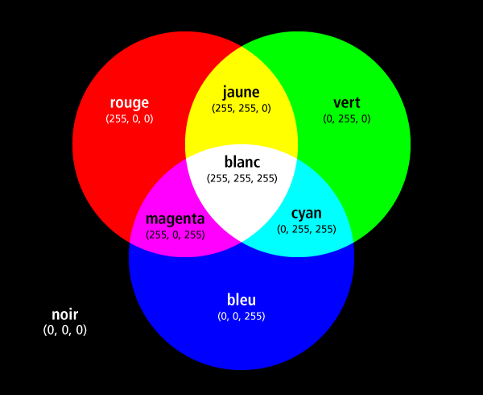
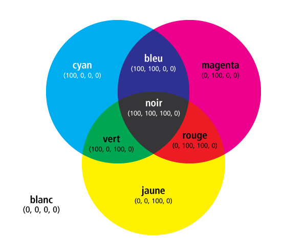
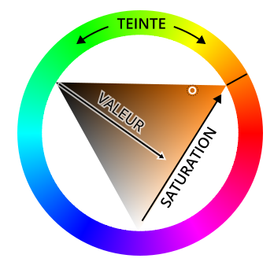

# Couleur

La couleur est un élément fondamental dans la communication visuelle et en conséquence en cartographie. D'un côté, la couleur est une des variables visuelles, mais au-delà de cette fonction, la couleur fonctionne également comme élément pour mettre en évidence certains éléments.

Techniquement, la couleur est le résultat de la perception humaine de la lumière. La lumière étant des ondes électromagnétiques, elle est associée à des longueurs d'onde précises. Les différences dans ces longueurs d'onde à l'intérieur du spectre visible des ondes électromagnétiques sont perçues par l'humain comme des couleurs.

La **théorie de la couleur** définit comment les différentes couleurs interagissent entre elles et comment elles sont perçues par l'humain. Ainsi, les couleurs sont typiquement divisées en couleurs primaires, secondaires et tetiaires, où les couleurs primaires sont le rouge, le jaune et le bleu (modèle RJB, en anglais RYB pour Red-Yellow-Blue). La couleur peut toutefois aussi être classifiée autrement selon la teinte, la saturation (l'intensité ou la pureté de la couleur) et la luminosité. Ces trois propriétés sont essentielles dans la perception de la couleur.

## Modèles de couleurs

Les couleurs peuvent être représentées de manière numérique selon plusieurs modèles qui varient entre autres en fonction du support et de la technique utilisée pour représenter la couleur. Nous allons voir ici les modèles suivants:

- le modèle RVB (ou RGB en anglais)
- le modèle CMJN (ou CMYK en anglais)
- le modèle TSV (ou HSV en anglais)

### Le modèle RVB

RVB est l'abréviation de «Rouge Vert Bleu», en anglais RGB signifie «Red Green Blue». Il s'agit d'un modèle de couleur qui est **basé sur la lumière** et il est utilisé notamment par tous les **écrans**. Un écran constitue la couleur par synthèse additive à partir des trois couleurs primaires qui sont le rouge, le vert et le bleu. En combinant ces trois couleurs primaires, il est possible d'obtenir n'importe quelle couleur qui est représentable dans le modèle RVB.

De manière concrète, une valeur numérique entre 0 (pour absence) et 255 est donnée à chacune des 3 couleurs primaires (255 est la valeur numérique la plus grande qui peut être représentée avec 1 octet, c'est-à-dire 8 bits). Ainsi, on peut régler la quantité de lumière rouge, vert et bleu.

Dans un modèle RVB, nous allons donc représenter une couleur à l'aide de 3 valeurs numériques, p.ex. (255, 0, 0) pour la couleur rouge. La première valeur représente la quantité de rouge, la deuxième la quantité de vert, et la troisième valeur la quantité de bleu.

L'absence de toutes les couleurs, la couleur (0, 0, 0), donne du noir, car nous avons absence de lumière. Si au contraire, nous mélangeons toutes les couleurs ensemble, nous obtenons la couleur avec le code (255, 255, 255) ce qui représente le blanc.

La figure ci-dessous montre les trois couleurs primaires ainsi que les combinaisons des couleurs, ensemble avec les codes couleurs:

### Le modèle CMJN

CMJN est l'abréviation de «Cyan Magenta Jaune Noir». En anglais, l'abréviation courante est CMYK ce qui signifie «Cyan Magenta Yellow Key» où «Key» est le noir.

Il s'agit ici d'un modèle de couleur qui est **basé sur la synthèse des couleurs sur papier** comme utilisé notamment pour peindre ou par les imprimantes. Sur le papier, la synthèse de la couleur est différente que celle de la lumière. En effet, si on combine les couleurs primaires sur le papier, on ne va obtenir du blanc. Le modèle CMJN utilise la **synthèse soustractive** par 3 autres couleurs primaires, et en plus le noir. Nous verrons plus loin pourquoi on ajoute le noir aux 3 couleurs primaires. Dans le modèle CMJN, les 3 couleurs primaires sont cyan, magenta et jaune, qui sont en fait les combinaisons des 3 couleurs primaires du modèle RVB.

Pour créer une couleur CMJN, nous allons également utiliser une valeur numérique pour chaque couleur, sauf que nous allons utiliser une valeur entre 0 et 100, valeur qui représente des pourcentages de couverture de chaque couleur. Ainsi, la couleur «cyan» est représentée par le code (100, 0, 0, 0). La dernière valeur représente le noir qui pour le moment sera toujours 0.

Voici les trois couleurs primaires du modèle CMJN ainsi que les combinaisons des couleurs:

Il y a un petit problème avec ces trois couleurs primaires du modèle CMJN. Les couleurs primaires utilisées pour l'impression ne sont jamais complètement pures. Et du coup, les combinaisons de couleurs ne seront pas parfaites. Ainsi, la combinaison de toutes les trois couleurs est censée donner du noir, mais en réalité, la couleur résultante ne sera pas tout à fait noire, mais plutôt une sorte de gris très foncé. Pour cette raison, le modèle CMJN ajoute le noir comme couleur primaire supplémentaire. Ainsi, nous aurons un modèle à 4 couleurs où le noir pur sera représenté par le code (0, 0, 0, 100) et non pas (100, 100, 100, 0).

Il faut encore noter que l'espace de toutes les couleurs que nous pouvons représenter avec le modèle CMJN ne correspond pas totalement à l'espace des couleurs RVB. Ainsi, un vert pur avec code RVB (0, 255, 0) de pourra pas être représenté dans le modèle CMJN. La couleur la plus proche en CMJN est la couleur (63, 0, 100, 0) qui en RVB correspond à peu près à la couleur avec le code (105, 190, 70) (en réalité, ceci dépend encore de l'imprimante que vous utilisez...). Ces différences dans les modèles de couleurs font d'ailleurs aussi qu'un document couleur imprimé ne sera jamais complètement identique au même document à l'écran. Et c'est la raison pourquoi nos photos sont souvent imprimées avec des couleurs un peu ternes même si elles ont l'air parfaites à l'écran.

Les logiciels de graphisme professionnels comme Adobe Illustrator ou Affinity Designer savent gérer ce genre de conversion entre modèles de couleurs et afficheront les couleurs aussi bien que possible. Par contre, ceci nécessite que si nous créons un document destiné à l'impression, nous devons donc utiliser le modèle CMJN pour définir les couleurs.

D'autres logiciels, dont Inkscape ou les logiciels SIG, gèrent moins bien ou pas du tout le modèle CMJN.

## Le modèle TSV

TSV est l'abréviation de **teinte, saturation, valeur**, en anglais **hue, saturation, value** (HSV).

Le modèle TSV peut être visualisé à l'aide d'une roue de couleurs que l'on trouve dans de nombreux logiciels informatiques:

La teinte correspond à la variable visuelle **couleur** comme définie par Jacques Bertin dans la sémiologie graphique. Dans le modèle TSV, il s'agit souvent d'un nombre entre 0 et 360 degrés, et parfois comme pourcentage entre 0 et 100.

La **valeur** du modèle TSV correspond à la pureté de la couleur, elle est exprimée en pourcentage. Plus la valeur est proche de 100%, plus la couleur est claire ou vive, et au contraire, avec une valeur proche de 0%, la couleur est sombre.

La **saturation** quant à elle définie l'intensité de la couleur. Elle est également exprimée en pourcentage. Plus la saturation est proche de 100%, plus la couleur est intense.

Toutefois, il faut encore noter que la valeur du modèle TSV ne correspond pas à la variable visuelle «valeur» de la sémiologie graphique. La variable visuelle «valeur», parfois appelée «saturation» ce qui n'est pas moins confus par rapport au modèle TSV, touche à la fois à la valeur et à la saturation du modèle TSV. En effet, la variable visuelle «valeur» de Bertin représente à la fois la clareté de la couleur (la valeur dans le modèle TSV) et la pureté (la saturation du modèle TSV).

Le modèle TSV est basé sur les couleurs de base du modèle RVB, et il est possible de convertir une couleur définie en TSV en RVB, et vice versa. Cependant, une conversion TSV / RVB en modèle CMJN n'est pas possible pour toutes les couleurs.

Le modèle TSV est intéressant pour la cartographie et souvent utilisé en graphisme en raison de sa proximité avec la perception de la couleur. Ainsi, il est souvent plus facile de trouver une teinte de couleur avec une roue de couleurs TSV par rapport à une sélection avec le modèle RVB.

Un modèle très proche au modèle TSV (mais pas identique) est le modèle **TSL** (teinte, saturation, luminosité). Ce, mais pas tout à fait identique. La luminosité dans le modèle TSL essaie de représenter la **quantité de lumière** dans la couleur. Une luminosité de 0% correspond ainsi à du noir, et 100% à du blanc.
